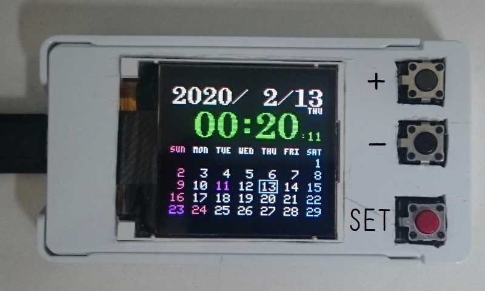

# Arduino Perpetial Calendar

## Description

A perpetial calendar by Arduino Nano.



Basically, holidays follow the Japanese calendar rules.

## Hardware

### Materials

* [Arduino Nano](https://store.arduino.cc/usa/arduino-nano) (or compatible product)
* 128×128 full color display using ST7735S driver [(example)](https://www.tindie.com/products/joylife/144-128x128-full-color-tft-lcd-display-module/)
* 3 tactile switches
* Wires, connectors, a prototyping board, etc...

### Circuit diagram


## Software 

### Build and transfer

Clone the source code and open "ArduinoPerpetialCalendar.ino" with Arduino IDE.

This sketch depends on following libraries. (You can add these by library manager)

* [Adafruit GFX Library](https://github.com/adafruit/Adafruit-GFX-Library)
* [Adafruit ST7735 and ST7789 Library](https://github.com/adafruit/Adafruit-ST7735-Library)

You can build the source code with following configuration.

* Board: "Arduino Nano"
* Processor: "ATmega328P (Old Bootloader)"

Then, you can transfer binary data to Arduino Nano by usual way.

### Tuning waiting time

This program calls `delay()` function to loop 20 times each second, but actually it's low accuracy because of an individual difference in the hardware.

You should edit `US_PER_FRAME` and `US_PER_FRAME_256TH` in ["ArduinoPerpetialCalendar.ino"](ArduinoPerpetialCalendar.ino#L24-L25) to tune to loop in actual 50 milliseconds exactly.

```
#define US_PER_FRAME        49978UL
#define US_PER_FRAME_256TH  86
```

`US_PER_FRAME_256TH` is for 1/256 microseconds, so it's 49978.3359375‬ microseconds in the above case. This is suitable for my Arduino Nano.

### Customize memorial days

Edit `memorialTable[]` in ["SpecialDate.h"](SpecialDate.h#L35-L47) to add your memorial days.

```diff
 PROGMEM static const int memorialTable[] = {
+    SPECIAL_DATE(1,  16), // My birthday
     SPECIAL_DATE(2,  3),
     SPECIAL_DATE(2,  14),
     SPECIAL_DATE(3,  3),
```

You must use `SPECIAL_DATE` macro. Basically, its arguments are the month and the day.

`SPDAT_XXXn` constants are defined to specify the somethingth day of the week. (For example, `SPDAY_WED2` means the 2nd Wednesday.)

### License

These codes are licensed under [MIT-License](LICENSE).
